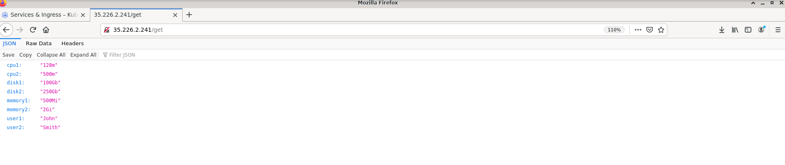
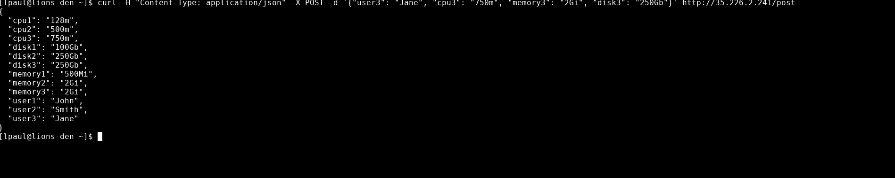

This app can read and update user quota comprising of cpu, memory and disk

### Technologies used
* Python 3.8
* Flask 

### Sample Deployment

 

The deployment above has been done on GKE cluster created out of [terraform module for GKE](https://github.com/terraform-google-modules/terraform-google-kubernetes-engine)
 